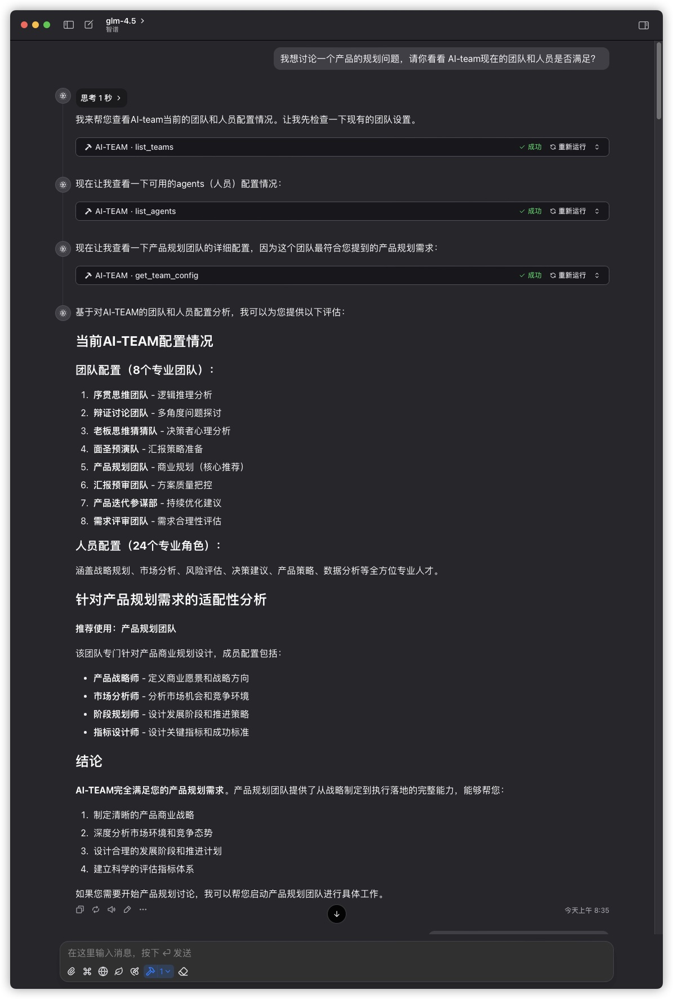
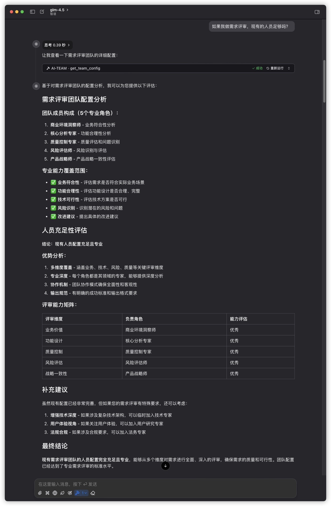
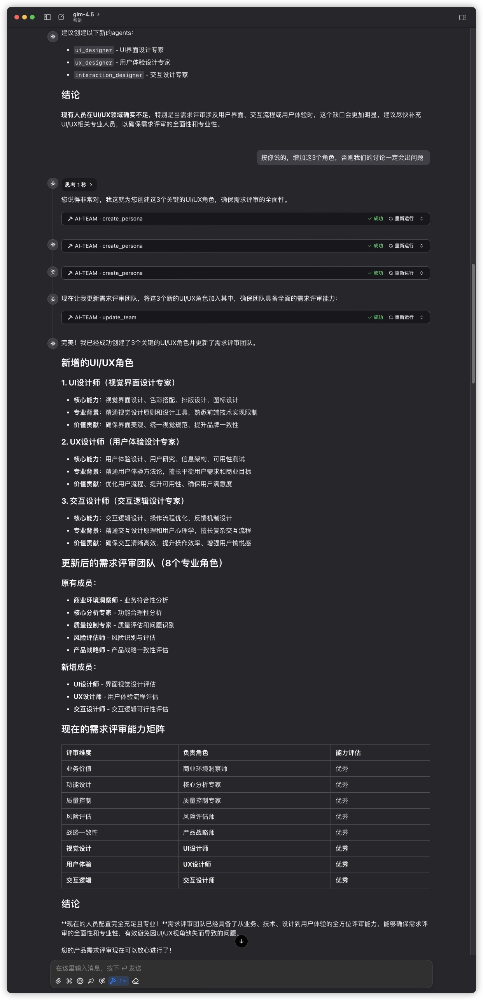
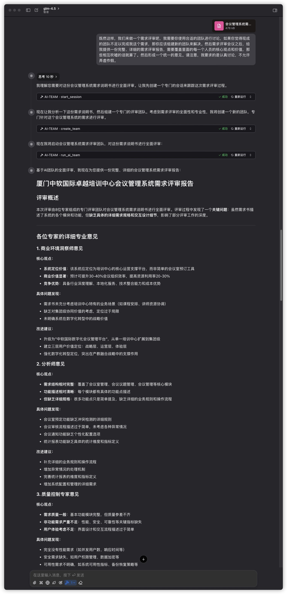

# 具体应用案例图示

## 一般应用流程

1. 告诉 模型，我要做什么，我想召集团队和人员进行讨论，让模型给你看看现有的人员和团队是否足够。

常用话术：

```plaintext
我想讨论一个 {xxxxx} 问题，{因为我遇到xxx问题 / 我准备要做什么事，想提前做准备}请你看看 AI-team现在的团队和人员是否满足？
```

2. 如果模型觉得不够 / 你觉得不够，你可以让模型给你补充人员。这个时候你可以提供具体人员的信息模型，让模型给你弄进去

常用话术

```plaintext
按你的意见，补充人员，{我给你提供 xxxx职能 的人员的一些关键附加信息：xxxxxxxx}
```

2. 团队和人员OK了，你就可以要求模型给你召开讨论，给你形成必要的报告

常用话术

```plaintext
现在我们来做 {什么事情，譬如一个需求评审}，我需要你使用合适的团队进行讨论，如果你觉得现成的团队不足以完成我这个需求，那你应该组建新的团队来解决。然后团队讨论之后，给我提供一份完整、详细的报告，需要覆盖里面的每一个人员的核心观点和价值，那些相互吹嘘的话就算了。然后形成一个统一的意见。请注意，我要求的是认真讨论，不允许弄虚作假。
```

4、独立场景：

- 将现有的产品文档，技术文档丢给AI，告诉他整理后更新到产品文档中，后面调用

其他可以类推

## 具体应用场景示范
这个示范，是使用百度文库的一个公开的需求说明书进行（也放在git这里了），然后使用chatwise工具配合glm-4.5模型进行。

### 查看团队和人员情况


### 讨论补充人员角色


### 补充人员角色


### 召回讨论会议


### 最终输出
